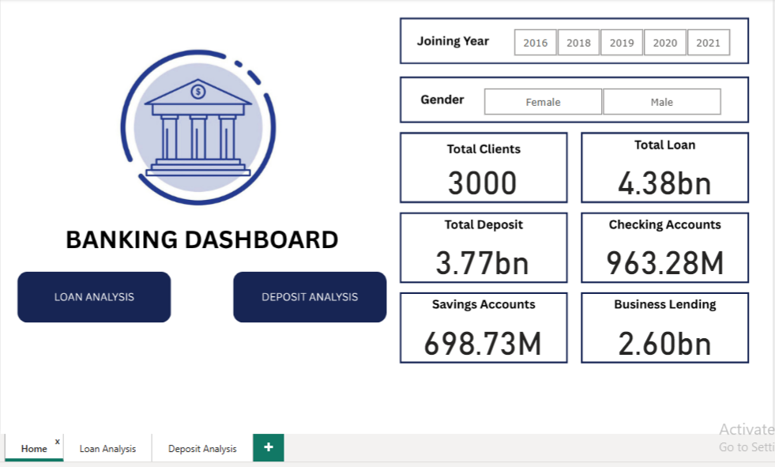
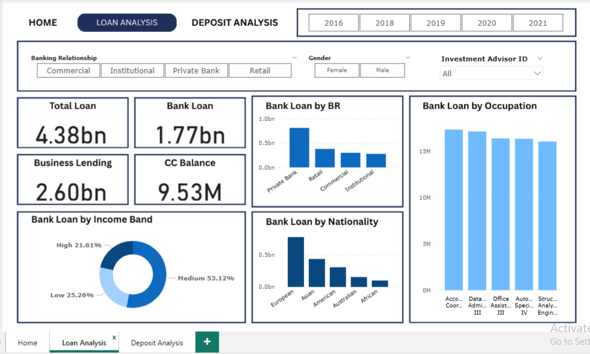
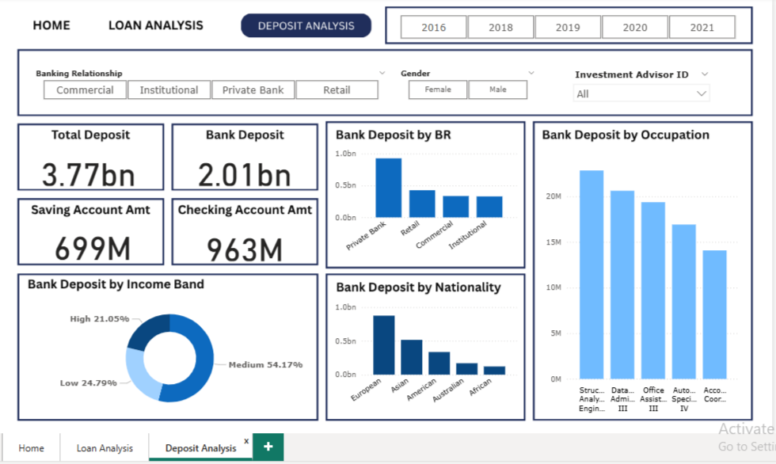

# 🏦Banking-Customer-Analytics--Deposit-Loan-Performance-Analysis
This project presents an end-to-end banking customer analytics solution developed using SQL Server, Python, and Power BI. The objective was to analyze customer demographics, financial behavior, deposits, loans, and banking products to generate actionable business insights.

### Problem Statement:- Develop a basic understanding of risk analytics in banking and financial services and understand how data is used to minimise the risk of loosing money while lending to customers.

## 📌 Project Workflow
Imported the raw banking dataset into SQL Server.
Connected Python (Jupyter Notebook) to SQL Server using pyodbc.
Performed data cleaning, preprocessing, feature engineering, and exploratory data analysis (EDA).
Exported the cleaned data for reporting.
Built an interactive Power BI dashboard to visualize customer, deposit, and loan insights.

## 📊 Dashboard

#### 📌 The Power BI dashboard provides insights into:
- Loan Analysis 
- Deposit Analysis

## 📈 Key Insights
- Identified that the majority of customers belong to the Medium Income Band and fall under the moderate-risk category (Risk Weight 2).
Found that Banking Relationship ID 3(Private Bank) serves the highest number of customers, making it the most active branch.
- Observed that European customers represent the largest customer segment.
- Discovered that Jade is the most common loyalty tier, followed by Silver, indicating strong customer engagement.
- Most customers own one or two properties, suggesting moderate asset ownership.
- Correlation analysis revealed a strong relationship between Bank Deposits and Checking Accounts (0.84) and Bank Deposits and Saving Accounts (0.75).
- Identified a positive relationship between Estimated Income and lending products, indicating that higher-income customers tend to utilize Bank Loans and Business Lending more frequently.
- Found a moderate positive correlation (0.42) between Bank Loans and Business Lending, suggesting customers using one lending product are more likely to use the other.
- The bank manages a loan portfolio of 4.38 billion and total deposits of 3.77 billion, with Business Lending (2.60 billion) accounting for a significant share of the total lending portfolio.
- Medium-income customers contribute the largest share of both bank loans (53.12%) and bank deposits (54.17%), making them the bank's primary customer segment.
- Customers with European nationality contribute the highest amount of both loans and deposits, indicating that this segment generates the largest business value.

#### Workflow: The raw banking dataset was imported into SQL Server for centralized storage. Python was connected to SQL Server using pyodbc to retrieve the data for preprocessing and exploratory data analysis. The cleaned data was then used to develop an interactive Power BI dashboard.

## 🛠️ Tools & Technologies
- SQL Server
- Python (Pandas, NumPy, Matplotlib, Seaborn, pyodbc)
- Jupyter Notebook
- Power BI

## 📂 Project Files 
- **Banking.csv** - Dataset
- **Banking_Analysis.ipynb** - Jupyter Notebook with complete analysis 
- **Banking_Analysis_Dashboard.pbix** - Power BI Dashboard  
- **images/**- Dashboard photo which is used in README.md

## ⚠️ Disclaimer
This project was created for educational and portfolio purposes. Dataset ownership belongs to its original source.
